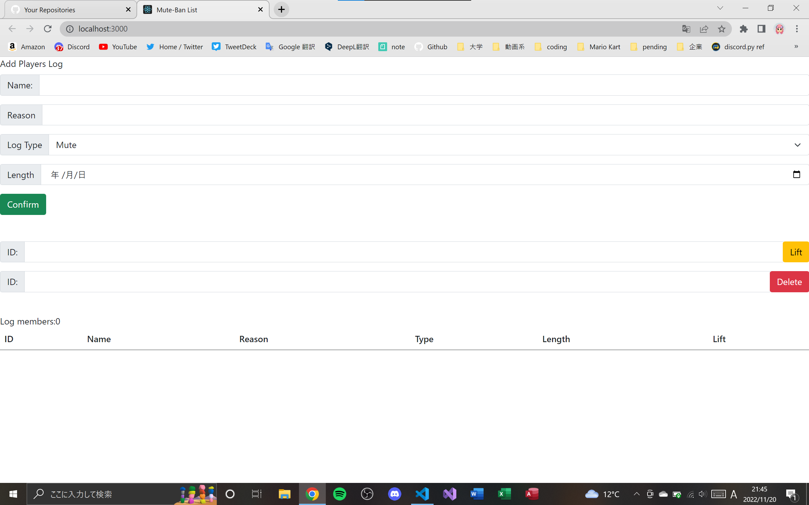
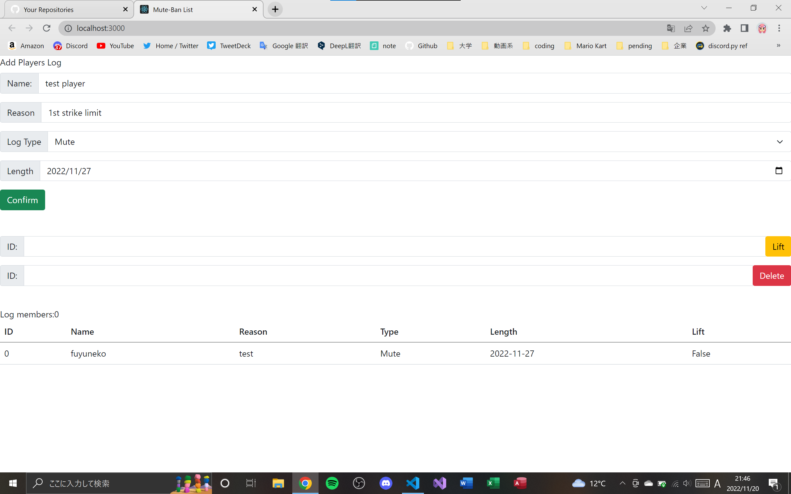
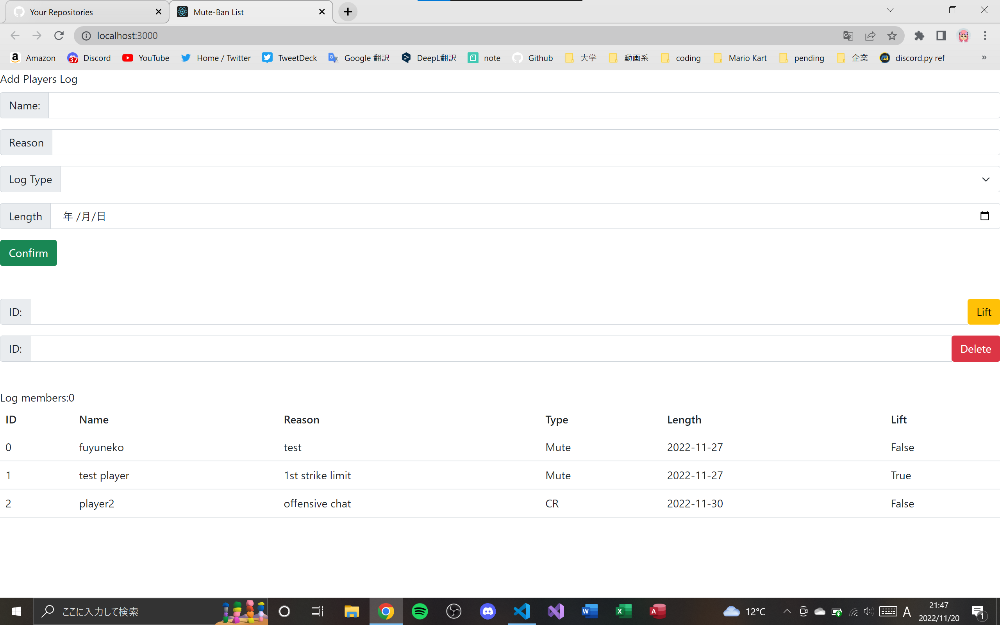
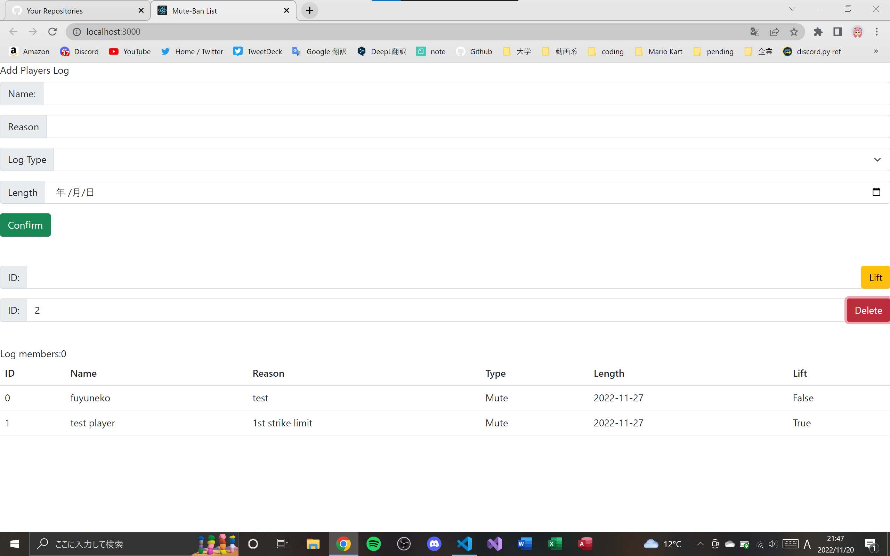

# React Mute-Ban List

### React触ってみただけ。

### ```npm start```

### localhost:3000 

実行するのは非推奨、自己責任で。
imagesフォルダはREADME用のファイルだけなので、消してOK。

ページ


追加するとこんな感じ。


LiftでLiftの値変更できるけど、文字列だから直した方がいい。


Deleteでリストの値を削除。



## 連絡先
discord: fuyuneko#3628  
twitter: https://twitter.com/wintercatmk8dx  

## ライセンス
Copyright (c) 2022 fuyuneko  
Released under the MIT license
https://opensource.org/licenses/mit-license.php  